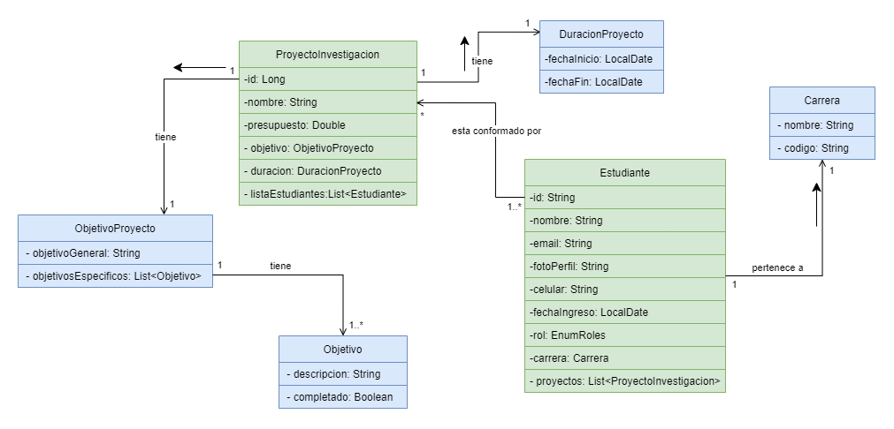

# Proyecto final para el curso de Fundamentos de Sistemas de Información

## Universidad de Antioquia

---

### Integrantes:

- Juan Camilo Cardona Calderón
- Dairo Joan Rivas García
- Joan Sebastian Muentes Casadiego
- Oscar Dario Botero Vargas

---

Documentación del proyecto: https://app.diagrams.net/#G1teNSsuDZWRYpCOGZatkuUJ2KA3OC8wR1

